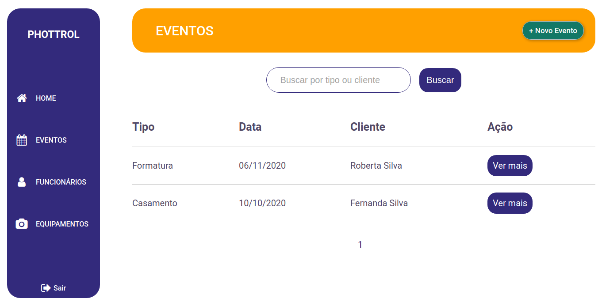
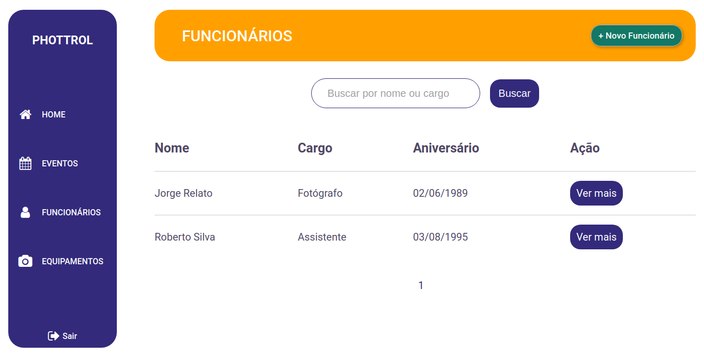
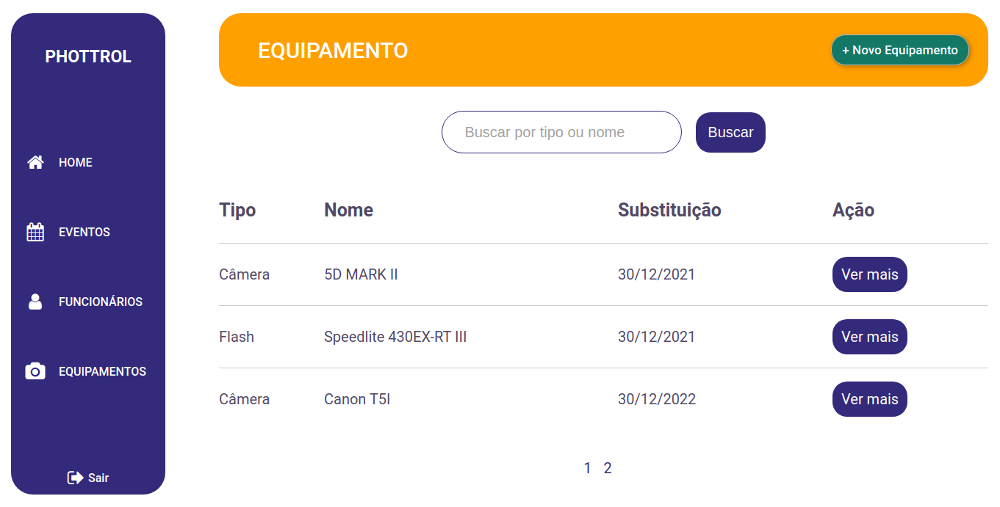
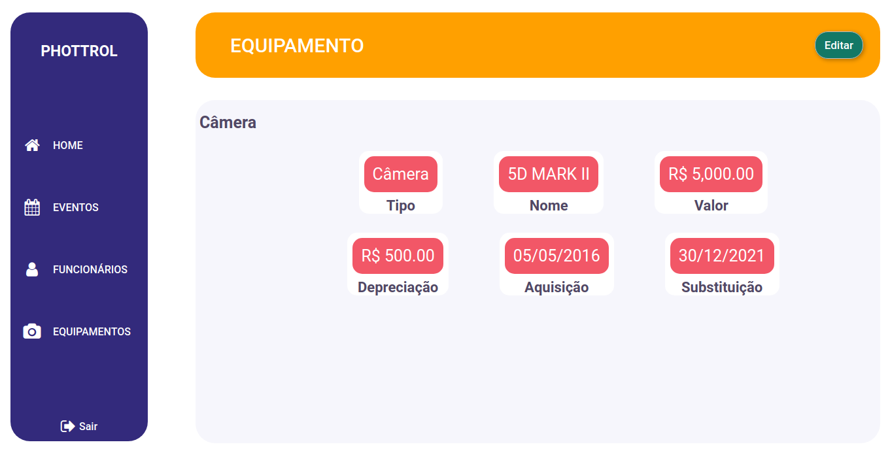
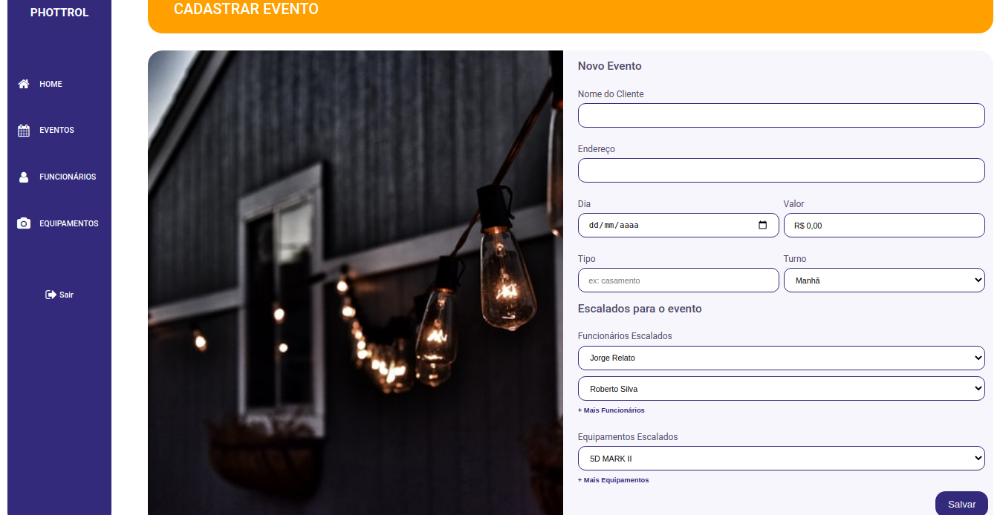

<h1 align="center">
    
</h1>

<h4 align="center"> 
	📸🙍‍♂️ Phottrol 🙍‍♂️📸
</h4>

<p align="center">
  
  
  
  
  <a href="https://www.linkedin.com/in/paulobeckman/">
    
  </a>
	
  
  <a href="https://github.com/paulobeckman/Phottrol/commits/master">
    
  </a>

  
   <a href="https://github.com/paulobeckman/Phottrol/stargazers">
    
  </a>
</p>


## 💻 Sobre o projeto

🙍‍♂️📸Phottrol - é uma forma de ter o controle de todos os eventos que vão ser realizados, também de dos funcionarios e equipamentos que fazem parte da empresa de fotografia. Além disso, podem ser escalados equipamentos que vão ser utilizados e funcionários que vão trabalhar no dia do evento.

A empresa ou fotógrafo podem cadastrar as seguintes informações:
- Eventos: 
    - Nome do cliente;
    - Endereço do local do evento;
    - Data do evento;
    - O valor de contratação do fotógrafo;
    - Tipo de evento;
    - Periodo do dia;
    - Funcionários escalados para o evento;
    - Equipamentos escalados para o evento;

- Funcionários:
    - Nome;
    - Cargo;
    - Data de aniversário;
    - Salário;

-Equipamentos:
    - Tipo;
    - Nome;
    - Custo do equipamento;
    - Data de aquisição;
    - Data de substituição;
    - Custo da depreciação do equipamento;


 
Projeto desenvolvido em **live coding no [meu canal da Twitch](t)**.
Esse foi o meu projeto feito do zero. Todo o avanço do projeto foi documento na twitch.


## 🎨 Layout

O layout da aplicação está disponível no Figma:

<a href="https://www.figma.com/file/Tn2yHlxVmj8HMvXCtwYAeE/Phottrol?node-id=0%3A1">
  
</a>


### Web

<p align="center" style="display: flex; align-items: flex-start; justify-content: center;">
	
  	
		
  

  

  

  
  
  

  
</p>

## 🛠 Tecnologias

As seguintes ferramentas foram usadas na construção do projeto:

- [Node.js][nodejs]
- [CSS][css]
- [HTML][HTML]
- [JavaScript][JavaScript]
- [Nunjucks][Nunjucks]
- [API UNSPLASH][unsplash]


## 🚀 Como rodar este projeto

Esse projeto tem uma parte e estão juntos o front-end e o back-end:
1. Back-end (arquivos server.js, routes.js, pasta confi, controllers, models) 
2. Front-end (pasta views, public e lib)


### Pré-requisitos

Antes de começar, você vai precisar ter instalado em sua máquina as seguintes ferramentas:
[Git](https://git-scm.com), [Node.js][nodejs]. 
Além disto é bom ter um editor para trabalhar com o código como [VSCode][vscode]

### 🎲 Rodando o Back End (servidor) e a aplicação web (Front End)

```bash
# Clone este repositório
$ git clone https://github.com/paulobeckman/Phottrol.git

# Acesse a pasta do projeto no terminal/cmd
$ cd Phottrol

# Instale as dependências
$ npm install

# Execute a aplicação em modo de desenvolvimento
$ npm start

# O servidor inciará na porta:3000 - acesse http://localhost:3000 
```


## 📝 Licença

Este projeto esta sobe a licença MIT. Veja a [LICENÇA](license) para saber mais.

Feito por Paulo Beckman 👋🏽 [Entre em contato!](https://www.linkedin.com/in/paulo-beckman/)

[nodejs]: https://nodejs.org/
[vscode]: https://code.visualstudio.com/
[license]: https://opensource.org/licenses/MIT
[CSS]: https://developer.mozilla.org/pt-BR/docs/Web/CSS
[HTML]: https://developer.mozilla.org/pt-BR/docs/Web/HTML
[JavaScript]: https://developer.mozilla.org/pt-BR/docs/Aprender/JavaScript
[Nunjucks]: https://www.npmjs.com/package/nunjucks
[t]: https://www.twitch.tv/paulobeckman
[unsplash]: https://unsplash.com/
